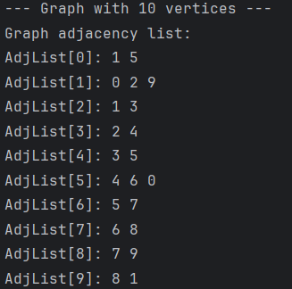
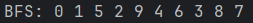
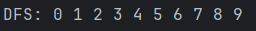
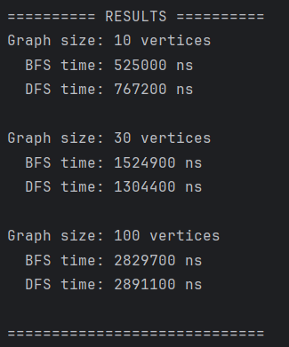

# Assignment 4

## Project Overview
A graph is a data structure consisting of vertices(nodes) and edges(connections between nodes).
- **Vertex** - a node that holds a single item. Each vertex has a list of adjacent vertices. When there is an edge connecting two vertices, we say that the vertices are adjacent to one another and that the edge is incident to both vertices.
- **Edge** - a connection between two vertices. Both vertices must exist before an edge can be created between them.

In this project I implemented an undirected graph using an adjacency listа and applied two standard graph traversal algorithms(BFS and DFS) on graphs of different sizes to compare their behavior and performance.

## Class Descriptions
* **Vertex.java** - represents a single node in the graph. Contains a private field id as a unique identifier, a constructor, a getter, and a toString() method.
* **Edge.java** - represents a connection between two vertices. Contains private fields source and destination, a constructor, getters, and a toString() method.
* **Graph.java** - represents the graph structure using an adjacency list - each vertex stores a list of its neighbors. The class contains methods to add vertices and edges, print the graph structure, and run BFS and DFS traversals. 
* **Experiment.java** - handles performance testing. Creates graphs of sizes 10, 30, and 100 vertices, runs BFS and DFS on each, measures execution time using System.nanoTime(), and prints the results. 
* **Main.java** - entry point of the program. Creates an Experiment object, runs all tests, and prints the results.

## Algorithm Descriptions

### Depth-First Search (DFS)
DFS starts at a given vertex and goes as deep as possible along one path before backtracking to explore other paths. It uses a visited[] array to make sure each vertex is visited only once. In my implementation backtracking is handled through recursion - the recursive call stack acts as the stack.

**Use cases:** detecting cycles, solving mazes, topological sorting

**Time complexity:** O(V + E) - every vertex and every edge is visited exactly once

---

### Breadth-First Search (BFS)
BFS starts at a given vertex and explores all its neighbors first, then moves to the next level of neighbors. It uses a Queue to keep track of which vertex to visit next, and a visited[] array to avoid visiting the same vertex twice.

**Use cases:** finding the shortest path, level-by-level traversal, connectivity problems

**Time complexity:** O(V + E) - every vertex and every edge is visited exactly once

## Experimental Results

### Graph Structure Output (10 vertices)

### BFS Traversal Output

### DFS Traversal Output

### Performance Results

| Graph Size | BFS Time (ns) | DFS Time (ns) |
|------------|---------------|---------------|
| 10 vertices | 525000 | 767200 |
| 30 vertices | 1524900 | 1304400 |
| 100 vertices | 2829700 | 2891100 |

---

### Analysis

**1. How does graph size affect BFS and DFS performance?**
As the graph size increases, execution time grows for both algorithms. Going from 10 to 100 vertices, BFS time increased from 525000 ns to 2829700 ns, and DFS from 767200 ns to 2891100 ns. This is expected since both algorithms process more vertices and edges as the graph grows.

**2. Which traversal is faster in your experiments?**
The results varied by graph size. For the 10-vertex graph DFS was slower than BFS (767200 ns vs 525000 ns), likely due to the overhead of the first recursive call. For 30 and 100 vertices BFS was slightly slower, but the difference was very small. Overall the speeds were comparable.

**3. Do results match the expected complexity O(V + E)?**
Yes. The execution time grew roughly proportionally as the graph size increased, which matches the expected O(V + E) complexity. Both algorithms visit every vertex and every edge exactly once, and this is reflected in the results.

**4. How does graph structure affect traversal order?**
The difference is clearly visible in the output. DFS produced a clean sequential order (0 1 2 3 4...) because it follows one path all the way to the end before backtracking. BFS produced a less predictable order (0 1 5 2 9 4 6...) because it explores all neighbors of the current vertex first, jumping between different parts of the graph depending on how edges are connected.

**5. When is BFS preferred over DFS?**
BFS is preferred when we need to find the shortest path between two vertices, because it explores level by level and always reaches the closest vertices first. DFS would find a path but not necessarily the shortest one.

**6. What are the limitations of DFS?**
DFS does not guarantee the shortest path. On very large or deep graphs, deep recursion can cause a stack overflow. The traversal order is also hard to predict since it depends on the order edges were added.

## Reflection
During this assignment I learned how graph traversal algorithms systematically visit every node in a graph. What surprised me was how different BFS and DFS feel even though they both visit every vertex exactly once and have the same O(V + E) complexity. BFS explores the graph level by level and always finds the closest vertices first, which makes it useful for shortest path problems. DFS dives as deep as possible into one path before backtracking, which makes it better suited for cycle detection and maze solving.

The main challenge I faced was implementing DFS correctly using recursion. At first I was confused about how backtracking works, but once I understood that the recursive call stack acts as the stack, it became clear. I also had to be careful with the visited[] array in both algorithms - without it the algorithms would loop forever on graphs with cycles. Overall this assignment gave me a solid understanding of how graphs work and why the choice of traversal algorithm matters depending on the problem.